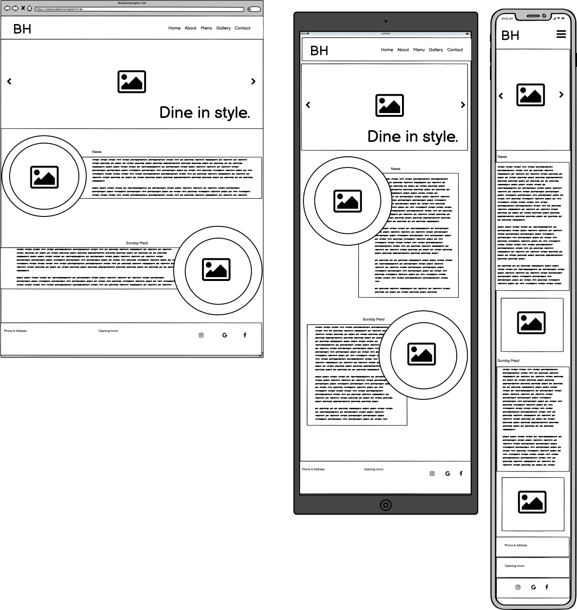
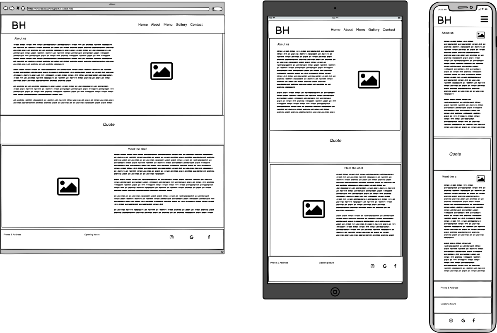
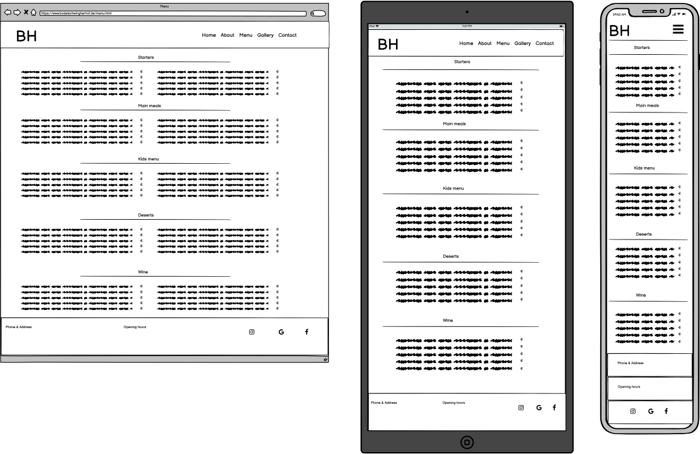
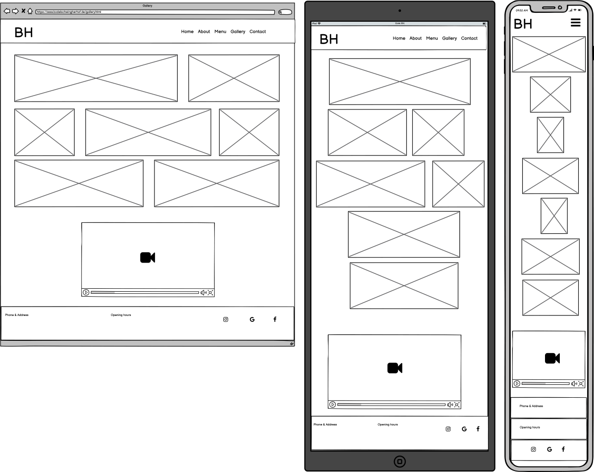
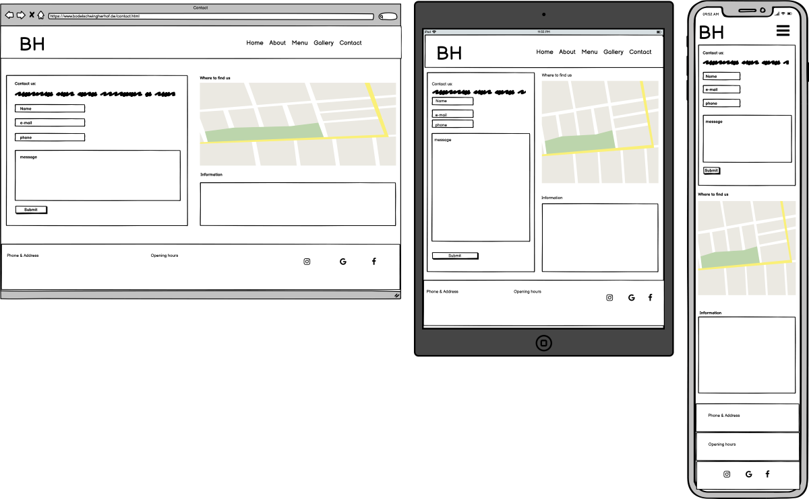

# Bodelschwinger Hof

(mockup image)

(link to deployed page)

## Table of Content

1. [Project Goals](#project-goals)
    1. [User Goals](#user-goals)
    2. [Site Owner Goals](#site-owner-goals)
2. [User Experience](#user-experience)
    1. [Target Audience](#target-audience)
    2. [User Requrements and Expectations](#user-requrements-and-expectations)
    3. [User Stories](#user-stories)
3. [Design](#design)
    1. [Design Choices](#design-choices)
    2. [Colour](#colours)
    3. [Fonts](#fonts)
    4. [Structure](#structure)
    5. [Wireframes](#wireframes)
4. [Technologies Used](#technologies-used)
    1. [Languages](#languages)
    2. [Frameworks & Tools](#frameworks-&-tools)
5. [Features](#features)
6. [Validation](#validation)
    1. [HTML Validation](#HTML-validation)
    2. [CSS Validation](#CSS-validation)
7. [Testing](#testing) 
    1. [Accessibility](#accessibility)
    2. [Performance](#performance)
    3. [Device testing](#performing-tests-on-various-devices)
    4. [Browser compatibility](#browser-compatability)
    5. [Testing user stories](#testing-user-stories)
8. [Bugs](#Bugs)
9. [Deployment](#deployment)
10. [Credits](#credits)
11. [Acknowledgements](#acknowledgements)

## Project Goals 

### User Goals
- Finding a restaurant that offers a nice atmosphere and good food.
- See a full menu with clear pricing.
- Find information about the restaurant.
- Find the location of the restaurant

### Site Owner Goals
- Increase in the number of customers.
- Promote the bussines.
- Provide a way for new and existing customers to contact the buissnes.
- Provide essential information about the bussines to customers.

## User Experience

### Target Audience
- People looking for a place to dine at
- People looking to order take away
- Groups of people looking for a place to carter a event
- Small to medium wedding parties

### User Requrements and Expectations

- A simple and intuitive navigation system
- Quickly and easily find relevant information
- Links and functions that work as expected
- Good presentation and a visually appealing design regardless of screen size
- An easy way to contact the bussines
- Simple content that the user can skim read
- Accessibility

### User Stories

1. As a user I want to know where the restaurant is lokated
2. As a user I want to know the opening times
3. As a user I want to find a phone number to call for reservation
4. As a user I want to leave some comment, suggestion or message to the staff
5. As a user I want to see the menu 
6. As a user I want to know the price range
7. As a user I want to see news about events or changes in opening times during holidays
8. As a user I want to see the Sunday meal offer
9. As a user I want to know more about the restaurant
10. As a user I want to know who is preparing the food
11. As a user I want to get a feel of what to expect at the restaurant
12. As a user I want to find the restaurant on social media

## Design

### Design Choices

### Colour

### Fonts

### Structure

### Wireframes

Home

About

Menu

Gallery

Contact

## Technologies Used

### Languages

### Frameworks & Tools

## Features

## Validation

### HTML Validation

### CSS Validation

## Testing 

### Accessibility

### Performance 

### Performing tests on various devices 

### Browser compatability

### Testing user stories

## Bugs

| **Bug** | **Fix** |
| ----------- | ----------- |
| Some bug | The fix for it |
| another bug | another fix |
| oh my so many bug | and this is how we fix them |

## Deployment

## Credits
Images not referenced below are owned by me.

### Media

In order of apearance:
- Photo by <a href="https://unsplash.com/@heathergill?utm_source=unsplash&utm_medium=referral&utm_content=creditCopyText">Heather Gill</a> on <a href="https://unsplash.com/s/photos/pots-and-pans?utm_source=unsplash&utm_medium=referral&utm_content=creditCopyText">Unsplash</a>
- Photo by <a href="https://unsplash.com/@mareksminder?utm_source=unsplash&utm_medium=referral&utm_content=creditCopyText">Claudia Altamimi</a> on <a href="https://unsplash.com/?utm_source=unsplash&utm_medium=referral&utm_content=creditCopyText">Unsplash</a>
- Photo by <a href="https://unsplash.com/@itssammoqadam?utm_source=unsplash&utm_medium=referral&utm_content=creditCopyText">Sam Moqadam</a> on <a href="https://unsplash.com/?utm_source=unsplash&utm_medium=referral&utm_content=creditCopyText">Unsplash</a> 
- <a href='https://www.freepik.com/photos/food'>Food photo created by freepik - www.freepik.com</a>
- Photo by <a href="https://unsplash.com/@itssammoqadam?utm_source=unsplash&utm_medium=referral&utm_content=creditCopyText">Sam Moqadam</a> on <a href="https://unsplash.com/?utm_source=unsplash&utm_medium=referral&utm_content=creditCopyText">Unsplash</a>
- Photo by <a href="https://unsplash.com/@itssammoqadam?utm_source=unsplash&utm_medium=referral&utm_content=creditCopyText">Sam Moqadam</a> on <a href="https://unsplash.com/?utm_source=unsplash&utm_medium=referral&utm_content=creditCopyText">Unsplash</a>
- Photo by <a href="https://unsplash.com/@itssammoqadam?utm_source=unsplash&utm_medium=referral&utm_content=creditCopyText">Sam Moqadam</a> on <a href="https://unsplash.com/?utm_source=unsplash&utm_medium=referral&utm_content=creditCopyText">Unsplash</a>
  
  

## Acknowledgements
